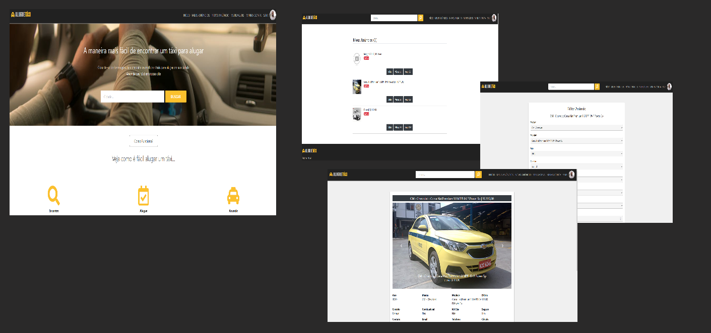

<h1 align="left">Aluguetaxi (Heroku)</h1>

<h2>Tecnologias</h2>
Esse projeto foi desenvolvido com as seguintes tecnologias:  
<ul>
    <li>Python / Django</li>
    <li>PostgreSql</li>
    <li>Html</li>
    <li>Css</li>
    <li>Javascript</li>
    <li>Bootstrap</li>
</ul>
<h2>Projeto</h2>

Aluguetaxi: Deploy do projeto pessoal, aluguetaxi, no Heroku. Atualmente, a versão final do site (mvp) pode ser acessada no endereço: https://www.aluguetaxi.com.br Versão Heroku: https://aluguetaxi.herokuapp.com
